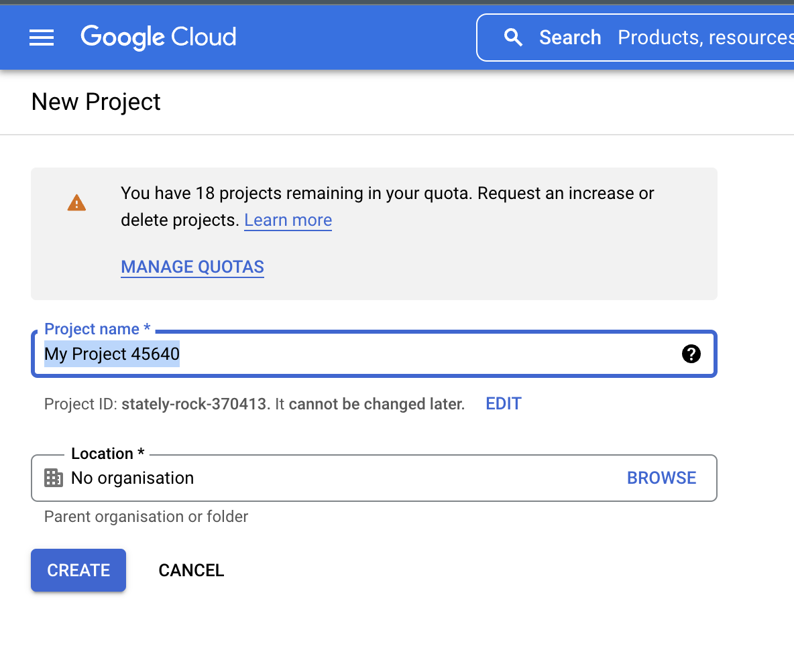
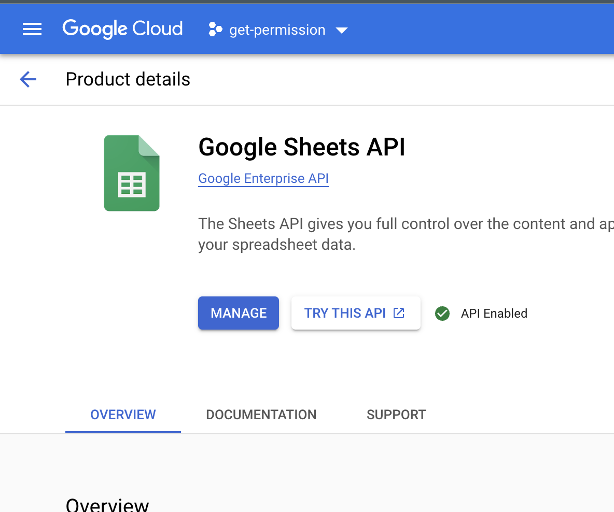

First create project in GCP, simply go to [Google Console](https://console.cloud.google.com/projectselector2/apis/library?pli=1&supportedpurview=project)
 and create a new project

The next step is to enable the APIs we are going to use. You'll see at the top of this very same page a link called: Enable APIs and Services.

Search for the ``Google Sheets API
`` and Enable it.

The next step is to create our [Service account](https://developers.google.com/android/management/service-account#create_your_service_account) credentials. For that, click on Credentials on the left panel and then Create Credentials.

A JSON file will be downloaded. Move this file to the directory where your python script will be created and rename it to client_secret.json.

Now we are good to create our spreadsheet in Google Sheets and share it with our credentials. To do that, open your client_secret.json file, copy the client_email information, and share your spreadsheet with this email. Please be certain to share it with the "can edit" option.

Finally, Change SPREADSHEET_ID in GoogleSheetAPI.py/SPREADSHEET_ID(LNO: 18)